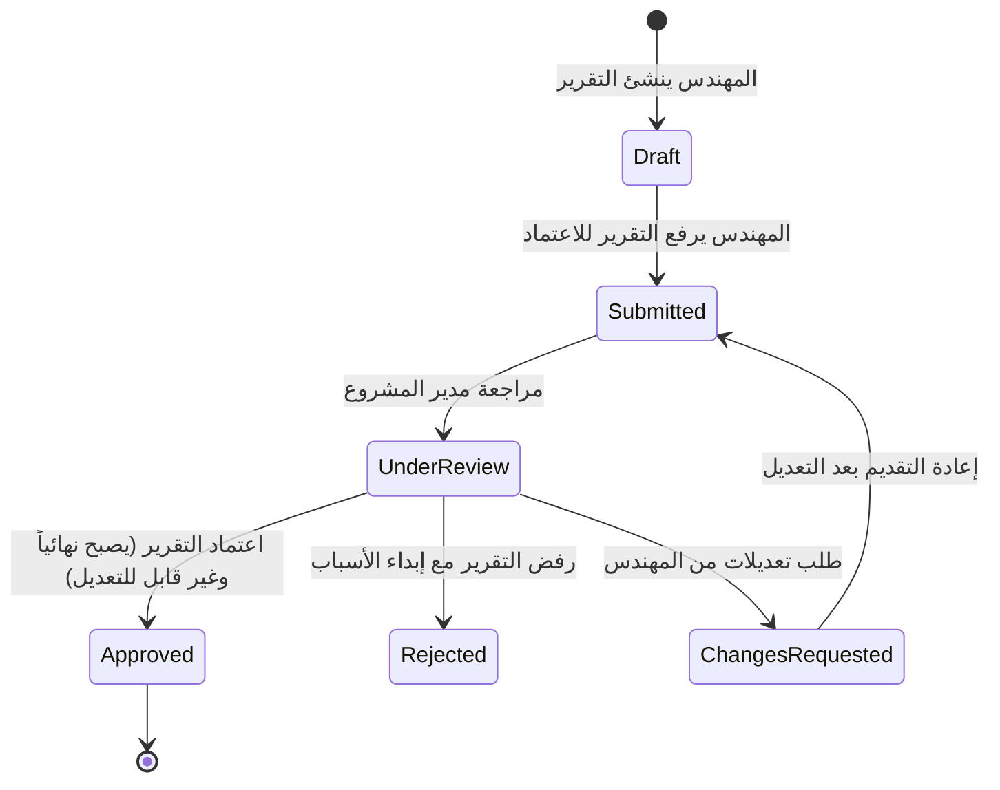

# 🏢 MTI Engineering Solutions - Enterprise Project Management System
> **نظام متكامل لإدارة المشاريع الهندسية، المواقع الميدانية، واعتماد البيانات والتقارير الفنية لحظياً.**


---

## 📑 فهرس المحتويات (Table of Contents)
1. [نظرة عامة على النظام (Executive Overview)](#1-نظرة-عامة-على-النظام-executive-overview)
2. [المعمارية التقنية (Architecture & Tech Stack)](#2-المعمارية-التقنية-architecture--tech-stack)
3. [هيكل المشروع والطبقات (Solution Structure)](#3-هيكل-المشروع-والطبقات-solution-structure)
   - [طبقة النطاق (MTI.ProjectManagement.Domain)](#31-طبقة-النطاق-mtiprojectmanagementdomain)
   - [طبقة التطبيق (MTI.ProjectManagement.Application)](#32-طبقة-التطبيق-mtiprojectmanagementapplication)
   - [طبقة البنية التحتية (MTI.ProjectManagement.Infrastructure)](#33-طبقة-البنية-التحتية-mtiprojectmanagementinfrastructure)
   - [واجهة برمجة التطبيقات (MTI.ProjectManagement.Api)](#34-واجهة-برمجة-التطبيقات-mtiprojectmanagementapi)
   - [الواجهة الأمامية (mti-project-management-web)](#35-الواجهة-الأمامية-mti-project-management-web)
4. [نماذج البيانات ودورات العمل (Core Workflows)](#4-نماذج-البيانات-ودورات-العمل-core-workflows)
   - [دورة حياة المشاريع والمواقع (Projects & Sites)](#41-دورة-حياة-المشاريع-والمواقع-projects--sites)
   - [دورة اعتماد التقارير الميدانية (Approval Workflow & Immutability)](#42-دورة-اعتماد-التقارير-الميدانية-approval-workflow--immutability)
   - [إدارة المهام الميدانية (Tasks Management)](#43-إدارة-المهام-الميدانية-tasks-management)
   - [التواصل اللحظي والدردشة (Real-Time SignalR Hubs & Chat)](#44-التواصل-اللحظي-والدردشة-real-time-signalr-hubs--chat)
   - [التخزين السحابي الآمن (Backblaze B2 Private Storage)](#45-التخزين-السحابي-الآمن-backblaze-b2-private-storage)
5. [نظام الصلاحيات والأمان (Security, RBAC & Audit)](#5-نظام-الصلاحيات-والأمان-security-rbac--audit)
6. [حسابات التشغيل الافتراضية (Default Seeded Users)](#6-حسابات-التشغيل-الافتراضية-default-seeded-users)
7. [واجهات الـ API المتاحة (API Endpoints Reference)](#7-واجهات-الـ-api-المتاحة-api-endpoints-reference)
8. [دليل الإعداد والتشغيل المحلي (Local Development Setup)](#8-دليل-الإعداد-والتشغيل-المحلي-local-development-setup)
9. [دليل النشر والإنتاج (Production Deployment Guide)](#9-دليل-النشر-والإنتاج-production-deployment-guide)

---

## 1. نظرة عامة على النظام (Executive Overview)

نظام **MTI Engineering Solutions** هو منصة سحابية تفاعلية موحدة لإدارة العمليات الهندسية الميدانية والمكتبية. يوفر النظام حلقة وصل لحظية بين:
* **الإدارة العليا ومديرو المشاريع (Admins & PMs)**: متابعة نسب الإنجاز، تفقد المواقع الجغرافية، اعتماد السجلات والتقارير الميدانية، وتوزيع المهام.
* **المهندسون الميدانيون (Field Engineers)**: توثيق الأعمال اليومية، رفع جداول القياسات والبيانات الفنية، إرفاق صور وفيديوهات الأعمال الإنشائية مع منع التعديل على البيانات بعد اعتمادها لضمان نزاهة السجلات القانونية والهندسية.

---

## 2. المعمارية التقنية (Architecture & Tech Stack)

تم بناء النظام باتباع مبادئ **Clean Architecture (Onion Architecture)** لعزل منطق العمل وقواعد النطاق عن البنية التحتية والواجهات الخارجية:

```
[ Frontend: Next.js 14 (React 18 + TS + Tailwind) ]
                     │  ▲
        REST / HTTPS │  │ SignalR WebSockets
                     ▼  │
     [ MTI.ProjectManagement.Api (Controllers & Middlewares) ]
                     │
     [ MTI.ProjectManagement.Application (DTOs, Contracts, Rules) ]
                     │
     [ MTI.ProjectManagement.Domain (Entities, Enums, Interfaces) ]
                     ▲
     [ MTI.ProjectManagement.Infrastructure (EF Core, B2 Storage, SignalR) ]
           │                                 │
           ▼                                 ▼
   [ Microsoft SQL Server ]       [ Backblaze B2 Private Cloud ]
```

### التقنيات المستخدمة:
* **الواجهة الخلفية (Backend)**: ASP.NET Core 8 Web API, C# 12.
* **الوصول لقاعدة البيانات (ORM)**: Entity Framework Core 8 (Code-First) مع Soft-Delete وفلاتر استعلام عامة.
* **الاتصال اللحظي (Real-time Gateway)**: ASP.NET Core SignalR WebSockets لدعم الدردشة والإشعارات الفورية.
* **التخزين السحابي (Cloud Storage)**: Backblaze B2 S3-Compatible API عبر الرفع بروابط مؤقتة ومحمية (Pre-signed URLs).
* **الواجهة الأمامية (Frontend)**: Next.js 14 App Router, TypeScript, Tailwind CSS, Lucide Icons.
* **المصادقة والتفويض (Auth & Security)**: JWT Bearer Tokens مع Refresh Tokens مدمجة في قاعدة البيانات، وسياسات حماية متقدمة (RBAC & Resource Scoping).

---

## 3. هيكل المشروع والطبقات (Solution Structure)

```
MTI Comany Project/
├── MTI.ProjectManagement.sln               # Solution File
├── src/
│   ├── MTI.ProjectManagement.Domain/        # Core Business Entities & Enums
│   ├── MTI.ProjectManagement.Application/   # Contracts, DTOs & Security Rules
│   ├── MTI.ProjectManagement.Infrastructure/# EF Core, B2 Cloud, SignalR Hubs
│   └── MTI.ProjectManagement.Api/           # Web API Controllers & Program.cs
├── mti-project-management-web/              # Next.js 14 Enterprise Web App
├── tests/
│   └── MTI.ProjectManagement.UnitTests/     # Unit & Integration Tests
├── docker/                                  # Dockerfiles (API & Web)
├── nginx/                                   # Nginx Reverse Proxy Config
├── docs/                                    # Deployment Guides & Specs
└── publish/                                 # Production Builds & Deploy Packages
```

---

### 3.1. طبقة النطاق (`MTI.ProjectManagement.Domain`)
تعد هذه الطبقة النواة المستقلة بالكامل الخالية من أي حزم أو تبعيات خارجية.

* **الكيانات الأساسية (Entities)**:
  * [Project](file:///src/MTI.ProjectManagement.Domain/Entities/ProjectAndSite.cs): المشروع الأساسي (الكود الفريد، الاسم، العميل، التواريخ، الحالة).
  * [Site](file:///src/MTI.ProjectManagement.Domain/Entities/ProjectAndSite.cs): المواقع الميدانية التابعة لكل مشروع وتتضمن العنوان وإحداثيات GPS (`Latitude`, `Longitude`).
  * [SiteAssignment](file:///src/MTI.ProjectManagement.Domain/Entities/ProjectAndSite.cs): ربط المهندس بموقع محدد وتحديد المسؤول الميداني الأساسي (`IsPrimary`).
  * [ProjectMember](file:///src/MTI.ProjectManagement.Domain/Entities/ProjectAndSite.cs): أعضاء فريق المشروع وأدوارهم.
  * [EngineerProfile](file:///src/MTI.ProjectManagement.Domain/Entities/ProjectAndSite.cs): السجل المهني والتخصص الهندسي ورقم القيد.
  * [ProjectDataRecord](file:///src/MTI.ProjectManagement.Domain/Entities/ProjectDataAndApproval.cs): التقارير والبيانات اليومية المرفوعة من الموقع، مع دعم خاصية الحصانة بعد الاعتماد (`IsImmutableForEngineers`).
  * [ProjectDataVersion](file:///src/MTI.ProjectManagement.Domain/Entities/ProjectDataAndApproval.cs): لقطات تاريخية (JSON Snapshots) لكل تعديل يطرأ على التقرير.
  * [DataApproval](file:///src/MTI.ProjectManagement.Domain/Entities/ProjectDataAndApproval.cs): سجل قرارات وتوصيات الاعتماد أو الرفض.
  * [DataSheet](file:///src/MTI.ProjectManagement.Domain/Entities/ProjectDataAndApproval.cs) & [DataSheetRow](file:///src/MTI.ProjectManagement.Domain/Entities/ProjectDataAndApproval.cs): جداول البيانات الهندسية الميدانية ذات الأعمدة والقيم الديناميكية.
  * [TaskItem](file:///src/MTI.ProjectManagement.Domain/Entities/TasksAndMedia.cs): المهام الميدانية مع مستويات الأولوية وتاريخ الاستحقاق.
  * [TaskStatusHistory](file:///src/MTI.ProjectManagement.Domain/Entities/TasksAndMedia.cs): تتبع تاريخ وحالات انتقال المهام ومَن قام بالتغيير والسبب.
  * [MediaFile](file:///src/MTI.ProjectManagement.Domain/Entities/TasksAndMedia.cs): الفهرس السحابي للوسائط المرفوعة على Backblaze B2.
  * [Conversation](file:///src/MTI.ProjectManagement.Domain/Entities/ChatAndNotifications.cs) & [Message](file:///src/MTI.ProjectManagement.Domain/Entities/ChatAndNotifications.cs): المحادثات المباشرة والجماعية، المرفقات، التفاعلات، وحالات استلام وقراءة الرسائل.
  * [User](file:///src/MTI.ProjectManagement.Domain/Entities/IdentityAndAccess.cs), [Role](file:///src/MTI.ProjectManagement.Domain/Entities/IdentityAndAccess.cs), [Permission](file:///src/MTI.ProjectManagement.Domain/Entities/IdentityAndAccess.cs): نظام المستخدمين والصلاحيات الدقيقة.
  * [AuditLog](file:///src/MTI.ProjectManagement.Domain/Entities/IdentityAndAccess.cs): السجل الرقابي والأمني الكامل لجميع العمليات الحساسة.

---

### 3.2. طبقة التطبيق (`MTI.ProjectManagement.Application`)
تحتوي على منطق العمل التجريدي وقواعد نقل البيانات وعقود الخدمات:
* **عقود الخدمات (Contracts)**:
  * `IAppDbContext`: واجهة عمليات قاعدة البيانات.
  * `IMediaStorageService`: التفاعل السحابي لتوليد Pre-signed Upload / Download URLs.
  * `INotificationService`: محرك إرسال الإشعارات وتوزيعها لحظياً.
  * `IResourceAuthorizationService`: فحص استحقاق المهندس لرؤية الموقع أو المشروع (Resource-based Access).
  * `IAuditService`: تسجيل أحداث التعديل والحذف وتوثيق التغييرات بالقيم القديمة والجديدة.
* **نماذج نقل البيانات (DTOs)**:
  * مصفوفة متكاملة من الـ Records تشمل المصادقة، المشاريع، المواقع، المهام، الدردشة، التقارير والتدقيق.
* **الصلاحيات (Security/Permissions)**:
  * تعريف ثوابت الأذونات الصارمة لجميع الوحدات (مثل `Projects.Create`, `Projects.Delete`, `ProjectData.Approve` ...إلخ).

---

### 3.3. طبقة البنية التحتية (`MTI.ProjectManagement.Infrastructure`)
تطبق العقود وتتصل بالعالم الخارجي:
* **قاعدة البيانات (`Persistence/AppDbContext`)**:
  * ضبط الـ Fluent API، وتطبيق الفلاتر الشاملة للحذف الناعم (`IsDeleted = false`).
  * تسجيل بيانات التدقيق التلقائي (`CreatedAt`, `CreatedBy`, `LastModifiedAt`).
* **بذر البيانات المبدئية (`Persistence/DatabaseSeeder`)**:
  * تهيئة الأدوار الأساسية، الصلاحيات، الحسابات الرسمية، وإعدادات النظام الافتراضية.
* **التخزين السحابي (`Services/BackblazeB2StorageService`)**:
  * التكامل مع Backblaze B2 عبر AWS SDK S3 Client لإنشاء توقيعات مؤقتة للملفات.
* **البوابة اللحظية (`SignalR/ProjectHub`)**:
  * استقبال اتصالات المهندسين والإداريين عبر الويب، وتوزيع أحداث المشاريع والمحادثات.

---

### 3.4. واجهة برمجة التطبيقات (`MTI.ProjectManagement.Api`)
نقطة الدخول الرئيسية للنظام عبر منافذ RESTful:
* **Controllers**:
  * `AuthController`: تسجيل الدخول، تجديد التوكنات، وتسجيل الخروج.
  * `ProjectsController`: إدارة المشاريع وإدراج المواقع التابعة لها مع تطبيق فلترة الصلاحيات.
  * `SitesController`: تفاصيل المواقع وإسناد/إلغاء إسناد المهندسين.
  * `ProjectDataController`: رفع واعتماد التقارير الميدانية وإدارة النسخ وجداول البيانات.
  * `TasksController`: إضافة وتعديل ونقل حالات المهام وتعيين المسؤولين.
  * `ChatController`: جلب وإنشاء المحادثات، إرسال الرسائل، وقراءة الحالات.
  * `MediaController`: إصدار روابط الرفع المباشر والتحميل السحابي المحمي.
  * `UsersController`: إدارة المستخدمين وتعيين الأدوار وتفعيل/إيقاف الحسابات.
  * `NotificationsController`: إدارة الإشعارات الفورية للمستخدم.
  * `AuditController`: استعراض وتصدير سجلات الأمان والتدقيق.
  * `SettingsController`: إعدادات النظام والبوابة اللحظية.
  * `SearchAndReportsController`: البحث الشامل ومؤشرات لوحة التحكم والتقارير.
* **Middleware**:
  * `SecurityHeadersMiddleware`: فرض ترويسات الأمان الصارمة (`X-Frame-Options`, `X-Content-Type-Options`, `HSTS`).
  * `ExceptionHandlingMiddleware`: اعتراض كافة الأخطاء غير المتوقعة وإرجاع ردود أخطاء موحدة (`ApiResponse`).

---

### 3.5. الواجهة الأمامية (`mti-project-management-web`)
تطبيق Next.js 14 يقدم لوحة تحكم ذكية وشاملة:
* **ثنائية اللغة الكاملة (Bilingual)**: واجهة عربية أصيلة مع دعم RTL كامل + واجهة إنجليزية LTR مع التبديل الفوري.
* **لوحات تحكم مخصصة للأدوار (Dynamic Dashboards)**:
  * **لوحة المدير (Admin/PM Dashboard)**: إحصائيات عامة، مركز الاعتماد السريع للتقارير الميدانية، متابعة المشاريع والمواقع وسجلات التدقيق.
  * **لوحة المهندس (Engineer Dashboard)**: قائمة المشاريع والمواقع المسندة للمهندس فقط، نموذج رفع التقارير وجداول البيانات الميدانية، والمهام المسندة له.
* **نظام دردشة متقدم (Enterprise Chat)**:
  * دعم المحادثات الفردية والجماعية.
  * علامات استلام وقراءة الرسائل المشابهة لتطبيقات المحادثة الفورية (Sent, Delivered, Read).
  * مؤشرات التواجد اللحظي (Online / Last Seen).
* **إشعارات منبثقة ومركز تنبيهات (Floating Toasts & Notifications Center)**.
* **مستعرض للملفات والمستندات الهندسية (Document & Media Inspector)**.

---

## 4. نماذج البيانات ودورات العمل (Core Workflows)



### 4.1. دورة حياة المشاريع والمواقع (Projects & Sites)
1. يقوم المدير بإنشاء المشروع وتحديد المدى الزمني واسم العميل.
2. يتم تقسيم المشروع إلى مواقع عمل جغرافية (Sites) مزودة بإحداثيات GPS.
3. يتم إسناد مهندس أو أكثر لكل موقع مع تحديد "المهندس الأساسي المسؤول".
4. **مبدأ خصوصية الموارد**: المهندس لا يرى في واجهته سوى المواقع المسندة إليه رسمياً.

### 4.2. دورة اعتماد التقارير الميدانية (Approval Workflow & Immutability)
* يقوم المهندس بملء البيانات الميدانية والجداول الفنية ورفع الصور ومستندات الفحص.
* حالة التقرير تتدرج: `Draft` ➔ `Submitted` ➔ `UnderReview` ➔ `Approved` أو `Rejected` أو `ChangesRequested`.
* **الحصانة بعد الاعتماد (`IsImmutableForEngineers`)**: بمجرد صدور قرار الاعتماد (`Approved`)، يُغلق السجل نهائياً ويُمنع المهندس من أي تعديل عليه، مما يحمي الوثائق من التلاعب القانوني أو الفني.
* يتم إنشاء نسخة تاريخية (`ProjectDataVersion`) تحوي لقطة JSON كاملة في حال طرأ أي تغيير مستقبلي مصرح به من الإدارة.

### 4.3. إدارة المهام الميدانية (Tasks Management)
* إنشاء المهام وربطها بالمشروع والموقع والمهندس المعني، وتحديد درجة الأولوية (`Low`, `Medium`, `High`, `Critical`).
* تتبع دورة حياة المهمة: `ToDo` ➔ `InProgress` ➔ `UnderReview` ➔ `Completed` أو `Cancelled`.
* حفظ سجل انتقالات الحالة تلقائياً (`TaskStatusHistory`) مع توثيق الوقت والمستخدم والتعليق.

### 4.4. التواصل اللحظي والدردشة (Real-Time SignalR Hubs & Chat)
* البوابة اللحظية تعمل على الرابط: `/hubs/project`.
* الأحداث اللحظية المدعومة:
  * `ProjectCreated`, `SiteAssigned`
  * `DataRecordSubmitted`, `DataRecordApproved`, `DataRecordRejected`
  * `TaskStatusChanged`, `TaskAssigned`
  * `MessageSent`, `MessageDelivered`, `MessageRead`
  * `UserOnline`, `UserOffline`

### 4.5. التخزين السحابي الآمن (Backblaze B2 Private Storage)
* جميع ملفات ومستندات وصور المواقع تُخزن في باكت خاص ومحمي بالكامل (`Private Bucket`).
* لا يتم رفع الملفات عبر سيرفر الـ API لتجنب استهلاك موارد السيرفر، بل يقوم الـ Backend بإنشاء **Pre-signed S3 Upload URL** بصلاحية 15 دقيقة، ليقوم المتصفح بالرفع المباشر إلى Backblaze B2.
* تحميل واستعراض الملفات يتم حصرياً عبر روابط تحميل مؤقتة موقعة رقمياً (`Pre-signed Download URLs`) تنتهي تلقائياً بعد فترة محددة.

---

## 5. نظام الصلاحيات والأمان (Security, RBAC & Audit)

### مصفوفة الأدوار الرئيسية (Roles):
| الدور (Role) | الوصف | نطاق الصلاحيات |
|---|---|---|
| **SystemAdmin** | مدير النظام التقني | تحكم كامل في إعدادات النظام، التخزين، والمستخدمين والسجلات. |
| **Admin** | الإدارة العامة | إدارة المشروعات والمواقع والتقارير والمستخدمين. |
| **ProjectManager** | مدير المشاريع | إدارة وتعديل المشاريع والمواقع والمهام، واعتماد أو رفض السجلات والتقارير. |
| **Engineer** | المهندس الميداني | قراءة بيانات المواقع المسندة له، وتقديم التقارير اليومية والمهام. |
| **Viewer** | مراقب / مراجع خارجي | اطلاع وقراءة فقط دون أي صلاحية للتعديل أو الإسناد. |

---

## 6. حسابات التشغيل الافتراضية (Default Seeded Users)

عند تشغيل النظام لأول مرة على قاعدة بيانات جديدة، يقوم `DatabaseSeeder` بإنشاء الحسابات التالية:

| البريد الإلكتروني / المستخدم | كلمة المرور | الدور | الملاحظات |
|---|---|---|---|
| `admin` أو `admin@mti.com` | `admin` | **SystemAdmin / Admin** | الحساب الإداري الرئيسي |
| `pm@mti.com` | `Pm@MTI2026!` | **ProjectManager** | حساب مدير المشروعات |
| `engineer@mti.com` | `Engineer@MTI2026!` | **Engineer** | حساب مهندس ميداني تجريبي |

---

## 7. واجهات الـ API المتاحة (API Endpoints Reference)

### 🔐 المصادقة والحسابات (`/api/auth`)
* `POST /api/auth/login`: تسجيل الدخول وإصدار التوكنات.
* `POST /api/auth/refresh-token`: تجديد التوكن المنتهي.
* `POST /api/auth/logout`: تسجيل الخروج وإلغاء صلاحية التوكن.
* `GET /api/auth/me`: الحصول على بيانات المستخدم الحالي وصلاحياته.

### 🏗️ المشاريع والمواقع (`/api/projects` & `/api/sites`)
* `GET /api/projects`: جلب قائمة المشاريع المصرح للمستخدم برؤيتها مع الفلترة والترقيم.
* `POST /api/projects`: إنشاء مشروع جديد.
* `GET /api/projects/{id}`: تفاصيل المشروع والمواقع التابعة له.
* `PUT /api/projects/{id}`: تحديث بيانات المشروع.
* `DELETE /api/projects/{id}`: الحذف الناعم للمشروع.
* `GET /api/projects/{id}/sites`: استعراض المواقع التابعة للمشروع.
* `POST /api/projects/{id}/sites`: إضافة موقع ميداني جديد للمشروع.
* `POST /api/sites/{id}/assign`: إسناد مهندس للموقع.
* `DELETE /api/sites/{id}/assign/{userId}`: إلغاء إسناد مهندس من الموقع.

### 📋 السجلات الميدانية والاعتمادات (`/api/project-data`)
* `POST /api/project-data`: تقديم سجل بيانات أو تقرير ميداني جديد.
* `GET /api/project-data/{id}`: استعراض التقرير الميداني وتفاصيل النسخ والجداول.
* `POST /api/project-data/{id}/submit`: تحويل التقرير من مسودة للاعتماد.
* `POST /api/project-data/{id}/approve`: اعتماد التقرير الميداني رسمياً.
* `POST /api/project-data/{id}/reject`: رفض التقرير مع إبداء الأسباب.
* `POST /api/project-data/{id}/request-changes`: طلب تعديلات على التقرير.
* `GET /api/project-data/pending-approvals`: قائمة التقارير المعلقة بانتظار الاعتماد.

### 📌 المهام الميدانية (`/api/tasks`)
* `GET /api/tasks`: قائمة المهام بحسب المشروع أو الموقع أو الشخص المكلف.
* `POST /api/tasks`: إنشاء مهمة جديدة وتكليف مهندس بها.
* `PUT /api/tasks/{id}/status`: تحديث حالة المهمة وتوثيق سبب الانتقال.
* `POST /api/tasks/{id}/comments`: إضافة تعليق أو ملاحظة فنية على المهمة.

### 💬 المحادثات والدردشة (`/api/chat`)
* `GET /api/chat/conversations`: جلب قائمة المحادثات النشطة.
* `POST /api/chat/conversations`: بدء محادثة مباشرة أو جماعية لمشروع.
* `GET /api/chat/conversations/{id}/messages`: استرجاع سجل رسائل المحادثة.
* `POST /api/chat/messages`: إرسال رسالة جديدة.
* `POST /api/chat/messages/{id}/read`: تحديث حالة قراءة الرسالة.

### ☁️ إدارة الوسائط السحابية (`/api/media`)
* `POST /api/media/presigned-upload`: طلب رابط رفع مباشر مؤقت إلى Backblaze B2.
* `POST /api/media/confirm-upload`: تأكيد نجاح الرفع وتسجيل الملف في النظام.
* `GET /api/media/{id}/download-url`: توليد رابط تحميل مؤقت محمي.

---

## 8. دليل الإعداد والتشغيل المحلي (Local Development Setup)

### المتطلبات المسبقة:
* [.NET 8.0 SDK](https://dotnet.microsoft.com/download/dotnet/8.0)
* [Node.js 18+](https://nodejs.org/) و [npm](https://www.npmjs.com/)
* [SQL Server](https://www.microsoft.com/sql-server/) (محلي أو سحابي)

### 1. إعداد الواجهة الخلفية (Backend API):
1. انتقل إلى مجلد الـ API:
   ```bash
   cd src/MTI.ProjectManagement.Api
   ```
2. تحقق من سلسلة الاتصال في `appsettings.Development.json`:
   ```json
   {
     "ConnectionStrings": {
       "DefaultConnection": "Server=YOUR_SQL_SERVER; Database=MTI_DB; User Id=...; Password=...; Encrypt=True; TrustServerCertificate=True;"
     }
   }
   ```
3. تشغيل الـ API:
   ```bash
   dotnet run
   ```
   * سيعمل الـ API على المنفذ: `http://localhost:5126` أو `https://localhost:7240`.
   * افتح واجهة Swagger عبر: `http://localhost:5126/swagger`.

### 2. إعداد الواجهة الأمامية (Frontend Web):
1. انتقل إلى مجلد الويب:
   ```bash
   cd mti-project-management-web
   ```
2. تثبيت الحزم:
   ```bash
   npm install
   ```
3. ضبط ملف `.env.local`:
   ```env
   NEXT_PUBLIC_API_URL=http://localhost:5126
   ```
4. تشغيل خادم التطوير:
   ```bash
   npm run dev
   ```
5. افتح المتصفح على: `http://localhost:3000`.

---

## 9. دليل النشر والإنتاج (Production Deployment Guide)

### النشر على استضافة RunASP / MonsterASP:
1. **الـ Backend API (`mtiapi.runasp.net`)**:
   * قم بتجهيز النشر عبر Visual Studio بالنقر بالزر الأيمن على `MTI.ProjectManagement.Api` ثم اختيار **Publish**.
   * تم ضبط ملف النشر [site93138-WebDeploy.pubxml](file:///src/MTI.ProjectManagement.Api/Properties/PublishProfiles/site93138-WebDeploy.pubxml) لفتح `https://mtiapi.runasp.net/swagger` تلقائياً عبر اتصال مشفر.
   * تأكد من إعداد `ConnectionStrings:DefaultConnection` في `appsettings.Production.json` أو لوحة تحكم الاستضافة.

2. **الـ Frontend Web (`mticompany.runasp.net`)**:
   * تأكد من ضبط الرابط في `.env.production`:
     ```env
     NEXT_PUBLIC_API_URL=https://mtiapi.runasp.net
     ```
   * بناء المشروع:
     ```bash
     npm run build
     ```
   * رفع مجلدات الإنتاج (`.next`, `public`, `package.json`) إلى خادم الويب وإعادة تشغيل الموقع.

---

## 👥 فريق العمل والمساهمة
* **المؤسسة**: MTI Engineering Solutions.
* **إدارة النظام والتطوير**: فريق هندسة البرمجيات والتطبيقات السحابية.
* **حقوق النشر والتوزيع**: جميع الحقوق محفوظة لشركة MTI Engineering Solutions © 2026.
